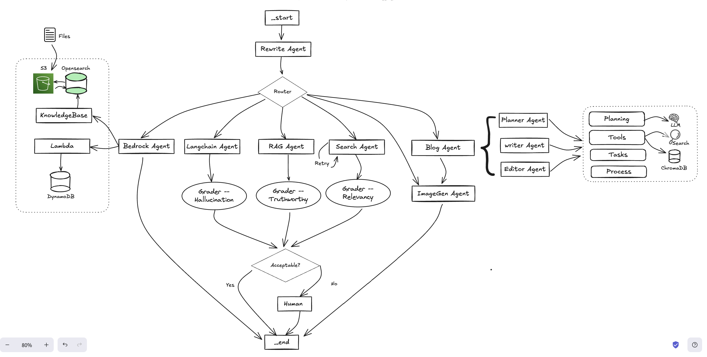

# Reasoning Orchestration Workshop using Amazon Bedrock, KnowledgeBase, and Langchain
This repository provides step-by-step instructions for creating a collaborative multi-agent system that leverages graph-based orchestration. It demonstrates how to combine Amazon Bedrock Agent with agents developed using open-source frameworks, enabling enhanced reasoning capabilities and seamless integration.  The exercise will guide you through the process of building a reasoning orchestration system using [Amazon Bedrock](https://aws.amazon.com/bedrock/), [KnowledgeBase for Amazon Bedrock](https://aws.amazon.com/bedrock/knowledge-bases/) and [Agents for Amazon Bedrock](https://aws.amazon.com/bedrock/agents/) as well as customer fine tuned models. We will also explore the integration of Bedrock agents with open source orchestration frameworks [LangGgraph](https://langchain-ai.github.io/langgraph/) and [CrewAI](https://github.com/crewAIInc/crewAI) for dispatching and reasoning.

 

## Overview
In this workshop, you will learn how to:

1. Build a multimodal agentic orchestration framework using AWS and open source tools
3. Set up and configure Amazon Bedrock, a foundation for building large language models (LLMs) and other AI-powered applications, including Agent and KNowledgeBase.
5. Set up a open source RAG solution using Chroma and an embedding engine of your choice.
6. Utilize Langchain, a framework for building applications with large language models, to orchestrate the reasoning process.
7. Integrate Langgraph, a tool for managing agentic services, to dispatch and reason about the various components of your system.
8. Integrate open source langgraph with Amazon Bedrock Agent which is acssociated with Amazon Lambda and Amazon Bedrock KnowledgeBase 

## Prerequisites
Workshop practioners are expected to have  LLM, Jupyter Notebook and Python working experience.

* AWS account with appropriate permissions to access the services used in this workshop, include Bedrock models access and IAM permission to access S3, DynamoDB, Lambda and others.
* Basic understanding of large language models, knowledge management, and AI-powered applications.
* Familiarity with Python programming language.
  
## Getting Started

Set up Amazon Bedrock: Follow the official Amazon Bedrock documentation to create your Bedrock environment and configure the necessary permissions and resources.

Integrate KnowledgeBase: Explore the KnowledgeBase service and learn how to integrate it with your Bedrock-powered application. Ensure that your knowledge base is populated with relevant information to support your reasoning tasks.

Utilize Langchain: Dive into the Langchain framework and understand how to use it to orchestrate the reasoning process. Explore the various Langchain components, such as agents, chains, and prompts, to build your reasoning system.

Integrate Langgraph: Introduce Langgraph into your system to manage the agentic services involved in the reasoning process. Learn how to dispatch tasks and reason about the various components of your system using Langgraph.

Develop your Reasoning Orchestration System: Combine the knowledge and tools you've acquired to build your reasoning orchestration system. Ensure that the different components (Bedrock, KnowledgeBase, Langchain, and Langgraph) work seamlessly together to provide the desired functionality.

Test and Refine: Thoroughly test your reasoning orchestration system, and make any necessary adjustments to improve its performance and reliability.

## Definitions

## Agents or Agentic Services:
Agents are created to fulfill specific roles and responsibilities. Each agent has predefined capabilities and embedded intelligence that enables them to focus on executing particular components or aspects of a project.

### Key Elements of an Agent
- Planning: By prompting elicits reasoning in large language models, AI agents can engage in complex problem-solving and planning processes.
- Reflection: This involves iterative refinement with self-feedback, allowing AI agents to continuously improve their performance. 
- Role Playing: Each agent is assigned a specific role, such as a researcher or analyst, to focus their efforts.
- Tasks: Agents maintain attention on their assigned tasks, ensuring efficient execution.
- Tools: Equipped with various tools for data retrieval, processing, and interaction.
- Colaboration: Agents collaborate with each other to complete tasks.
- Guardrails: Safety measures and protocols to ensure reliable and ethical operations.
- Memory: Ability to store and recall past interactions and data, enhancing decision-making.

### Multi-Agent Collaboration
Multi-agent collaboration involves multiple agents working together to achieve complex goals. This collaboration can take various forms depending on the nature and requirements of the tasks. Effective collaboration ensures that tasks are completed efficiently and accurately. Here are the few typical types:

- Sequential: Agents perform tasks in a predetermined order, where each step depends on the completion of the previous one.
- Hierarchical: Agents follow a structured hierarchy, with higher-level agents overseeing and coordinating the activities of lower-level agents.
- Asynchronous: Agents operate independently, handling tasks as they arise without adhering to a fixed sequence, allowing for flexibility and parallel processing.

## Resources
* [Amazon Bedrock Documentation](https://docs.aws.amazon.com/bedrock/)
* [Amazon OpenSearch Documentation](https://docs.aws.amazon.com/opensearch-service/)
* [Amazon Bedrock Agent Document](https://docs.aws.amazon.com/bedrock/latest/userguide/agents.html)
* [Langchain Agent Documentation](https://python.langchain.com/v0.1/docs/modules/agents/)
* [Langgraph Documentation](https://langchain-ai.github.io/langgraph/)
* [CrewAI Framwork](https://github.com/crewAIInc/crewAI)
  
## Conclusion
By the end of this workshop, you will have a solid understanding of how to build a agentic orchestration system using Amazon Bedrock, KnowledgeBase, Langchain, and Langgraph. This knowledge will enable you to create powerful genreatiev AI-powered applications that can effectively reason about complex problems and make informed decisions.

